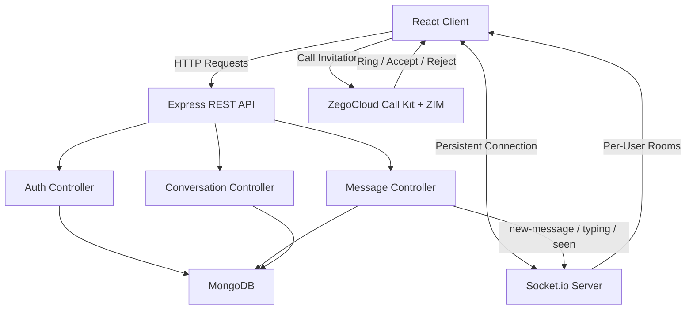

# Wave — Real-Time Chat Application

<p align="center">
  <em>A full-stack real-time messaging platform with live typing indicators, read receipts, group chats, reactions, and integrated voice/video calling.</em>
</p>

<p align="center">
  
  
  
  
  
  
  
  
  
</p>

<p align="center">
  
</p>

---

## 🚀 Live Demo

Experience Wave in action: **[Wave](https://wave-nzpml2fvr-radhika-guptas-projects-cc42e461.vercel.app/)**

---

## About

**Wave** is a full-stack real-time chat application built on the MERN stack, designed to replicate the core experience of modern messaging apps — live delivery, presence, typing indicators, read receipts, group conversations, and in-app calling — all wired together over a persistent Socket.io connection layered on a REST API.

The project was built incrementally, feature by feature: starting from basic real-time messaging, then layering in typing indicators, read receipts, online presence, group chats with admin roles, message reactions/editing/deletion, unread badges, and finally voice/video calling through ZegoCloud's Call Kit.

---

## Features

| Feature | Status |
|----------|--------|
| Real-Time Messaging (Socket.io) | ✅ |
| Typing Indicators | ✅ |
| Read Receipts (Double Ticks) | ✅ |
| Online / Offline Presence | ✅ |
| Unread Message Badges | ✅ |
| Group Chats | ✅ |
| Group Admin Controls | ✅ |
| Leave Group | ✅ |
| Message Reactions | ✅ |
| Edit / Delete Messages | ✅ |
| File, Image, Video & Audio Attachments | ✅ |
| Voice & Video Calling (ZegoCloud) | ✅ |
| Call Logs as Chat Messages | ✅ |
| Block User | ✅ |
| Google OAuth Login | ✅ |
| JWT Authentication | ✅ |

---

## Tech Stack

| Layer | Technology |
|--------|------------|
| Frontend | React + Vite |
| Styling | Tailwind CSS |
| Animation | Framer Motion |
| Real-Time Engine | Socket.io |
| Backend | Node.js + Express |
| Database | MongoDB + Mongoose |
| Authentication | JWT + Google OAuth |
| Voice / Video Calling | ZegoCloud (Call Kit + ZIM) |
| Icons | Lucide React |
| Notifications | Sonner |

---

## System Architecture



---

## Real-Time Architecture Highlights

Wave's socket layer is built around **per-user rooms** rather than per-conversation-only delivery:

```text
User connects
    ↓
socket.emit("setup", userId)
    ↓
socket.join(userId)   ← personal room, always joined
    ↓
Messages delivered via io.to(participantId) for every participant
    ↓
Delivered regardless of which conversation the recipient currently has open
```

This ensures a message, unread badge, or sidebar preview update reaches a user in real time even if they're sitting on the chat list with no conversation open — not just while they're actively viewing that specific thread.

Conversation-scoped rooms (`join-conversation` / `leave-conversation`) are still used separately for **typing indicators** and **read receipts**, since those only matter while both users have the same chat actively open.

---

## Project Structure

```text
Wave

│

├── Wave-backend
│   ├── src
│   │   ├── controllers
│   │   ├── db
│   │   ├── middlewares
│   │   ├── models
│   │   ├── routes
│   │   ├── socket
│   │   └── utils
│   │
│   ├── .env.sample
│   └── package.json
│
├── Wave-frontend
│   ├── src
│   │   ├── api
│   │   ├── components
│   │   ├── pages
│   │   └── services
│   │
│   ├── .env.sample
│   └── package.json
│
├── postman
│   └── Wave.postman_collection.json
│
└── system-architecture.txt
```

---

## Core Flows

### Sending a Message

```text
User types message
    ↓
Typing event emitted (debounced, 2s timeout)
    ↓
Message sent via REST (POST /messages)
    ↓
Message persisted in MongoDB
    ↓
Socket emits "new-message" to all participants' personal rooms
    ↓
Recipient(s) receive it instantly, regardless of open conversation
    ↓
If conversation is open on recipient's side → auto-marked as seen
    ↓
"messages-seen" emitted back → sender's ticks update to double-check
```

### Starting a Call

```text
User taps Voice/Video icon
    ↓
ZegoCloud Call Invitation sent to target user(s)
    ↓
Recipient sees incoming call popup (ZIM signaling)
    ↓
Accepted → both users join ZegoCloud room, call UI takes over
    ↓
Call ends → duration calculated
    ↓
Call outcome logged as a message (Missed / Declined / Completed · duration)
    ↓
Rendered as a call-log pill in the chat + sidebar preview
```

---

## Environment Variables

### Backend (`Wave-backend/.env`)

```env
PORT=
MONGODB_URI=
CORS_ORIGIN=
ACCESS_TOKEN_SECRET=
ACCESS_TOKEN_EXPIRY=
REFRESH_TOKEN_SECRET=
REFRESH_TOKEN_EXPIRY=
CLOUDINARY_API_SECRET=
CLOUDINARY_API_KEY=
CLOUDINARY_CLOUD_NAME=
GOOGLE_CLIENT_ID=
EMAIL_USER=
EMAIL_PASS=
FRONTEND_URL=
```

### Frontend (`Wave-frontend/.env`)

```env
VITE_BACKEND_URL=
VITE_SOCKET_URL=
VITE_GOOGLE_CLIENT_ID=
VITE_ZEGO_APP_ID=
VITE_ZEGO_APP_SIGN=
```

> ⚠️ `VITE_ZEGO_APP_SIGN` is used client-side for development via `generateKitTokenForTest`. For production, token generation should move to the backend using `ServerSecret` to avoid exposing the AppSign in the client bundle.

---

## Getting Started

### Clone

```bash
git clone https://github.com/Radhikagupta25/Wave.git
```

### Install

```bash
# Backend
cd Wave-backend
npm install

# Frontend
cd ../Wave-frontend
npm install
```

### Run

```bash
# Backend
cd Wave-backend
npm run dev

# Frontend
cd ../Wave-frontend
npm run dev
```

---

## API Collection

A complete Postman collection is included for testing every endpoint.

```
postman/
    Wave.postman_collection.json
```

Included requests:

### Conversation

- Create or Get Conversation
- Get All Conversations
- Get Conversation by ID
- Create Group
- Leave Group
- Get Group Info
- Make Group Admin

### Message

- Send Message
- Get Messages
- Mark Messages as Seen
- Log Call

### Authentication

- Register
- Login
- Google Login
- Verify Email
- Logout
- Refresh Token

### User

- Search Users
- Block User
- Unblock User

### Attachments

- Upload Attachment

---

## API Endpoints

### Conversation

```
POST    /conversations
GET     /conversations
GET     /conversations/:id
POST    /conversations/group
PATCH   /conversations/:conversationId/leave
GET     /conversations/group-info/:id
```

### Message

```
POST    /messages
GET     /messages/:conversationId
PATCH   /messages/:conversationId/seen
POST    /messages/call-log
```

### Authentication

```
POST    /register
POST    /login
POST    /google-login
GET     /verify-email/:token
POST    /logout
POST    /refreshToken
```

### User

```
GET     /users/search
POST    /users/:userId/block
POST    /users/:userId/unblock
```

### Attachments

```
POST    /attachments/upload
```

---

## Socket Events

| Event | Direction | Purpose |
|-------|-----------|---------|
| `setup` | Client → Server | Registers user's personal room on connect |
| `join-conversation` | Client → Server | Joins a conversation-scoped room |
| `leave-conversation` | Client → Server | Leaves a conversation-scoped room |
| `typing` / `stop-typing` | Bidirectional | Live typing indicator |
| `new-message` | Server → Client | Real-time message delivery |
| `messages-seen` | Server → Client | Read receipt sync |
| `user-online` / `user-offline` | Server → Client | Presence updates |
| `online-users` | Server → Client | Full presence snapshot on connect |

---

## Why This Project?

✔ Real-Time Messaging Architecture (not just a CRUD chat log)

✔ Per-User Socket Rooms for Reliable Delivery

✔ Group Chats with Role-Based Permissions

✔ Third-Party Voice/Video SDK Integration

✔ Read Receipts, Typing Indicators & Presence

✔ Message Reactions, Editing & Soft Deletion

✔ Clean, Modular MERN Architecture

---

## Roadmap

- [ ] Move ZegoCloud token generation to the backend for production security
- [ ] Message pagination for large conversation histories
- [ ] Push notifications for offline users
- [ ] Unit & integration test coverage
- [ ] Docker support
- [ ] CI/CD pipeline
- [ ] Message search within conversations

---

## License

This project is licensed under the MIT License.

---

## Support

If you found this project interesting:

⭐ Star the repository

🍴 Fork it

🐞 Open Issues

🚀 Submit Pull Requests

---

<p align="center">

Built with ❤️ by <b>Radhika Gupta</b>

</p>
